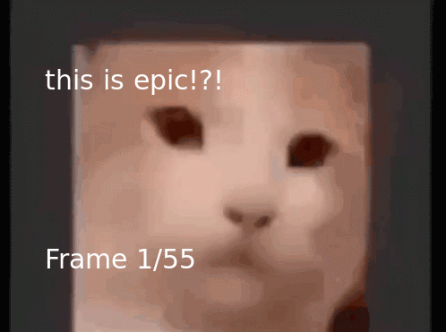

<div align="center">
    <br>
    <h1>canvas-gif</h1>
	<h3><code>npm i canvas-gif</code></h3> 
    
    
</div>

### What is canvas-gif?

canvas-gif is an NPM library that allows you to manipulate the frames of GIFs using [node-canvas](https://github.com/Automattic/node-canvas).

### How does it work?

It works by following these instructions:

1. Read the input GIF as a [Buffer](https://nodejs.org/api/buffer.html) (optional: coalesce the GIF if the option has been enabled and [graphicsmagick](http://www.graphicsmagick.org) is available)
2. Decode the GIF into [UInt8Array](https://developer.mozilla.org/en-US/docs/Web/JavaScript/Reference/Global_Objects/Uint8Array)(s)
3. For each frame in the GIF, create a canvas instance
4. Transform the UInt8Array into canvas image data and put it onto the context
5. Pass the context and other relevant information to the user defined editFrame function that will continue to manipulate the context.
6. Add the newly edited frame's context to the encoder
7. Output the encoder's data as a Buffer and return it

### How can I make use of it?

You can download it using npm by running

```
npm i canvas-gif
```

And you can then proceed to use it in your code. For an example of how to do so, please check out the [example](example) folder.

### Options

All of these options are optional! _wow_

-   **coalesce** - Whether the GIF should be coalesced by GraphicsMagick before being processed by the engine. Requires GraphicsMagick to be installed - if it is not and the option is true and error will be thrown and the code will continue with the original file buffer. Defaults to **false**
-   **delay** - The amount of delay between each frame in ms. Defaults to **0**
-   **repeat** - How many times the GIF should repeat. If the value is 0, it will repeat forever. Defaults to **0**
-   **algorithm** - The algorithm the encoder should use. Can be one of **neuquant** and **octree**. Defaults to **neuquant**
-   **optimiser** - Whether the encoder should use its in-built optimiser. Defaults to **false**
-   **fps** - The amount of frames to render per second. Defaults to **60**
-   **quality** - The quality of the GIF. A value between 1-100. The higher the number, the better quality the GIF will be. Defaults to **100**

### Common Errors

#### There was an error during coalescing: Stream yields empty buffer. Reverting buffer to file buffer!

This error happens if the coalescing option is enabled but you are missing GraphicsMagick. Please install it from [here](http://www.graphicsmagick.org/download.html) and if the error persists feel free to report it as a problem and I'll try my best to help!

<sub>See the code's license <a href="license.md">here.</sub>

### To-do

-   Return emitter for easy event handling
